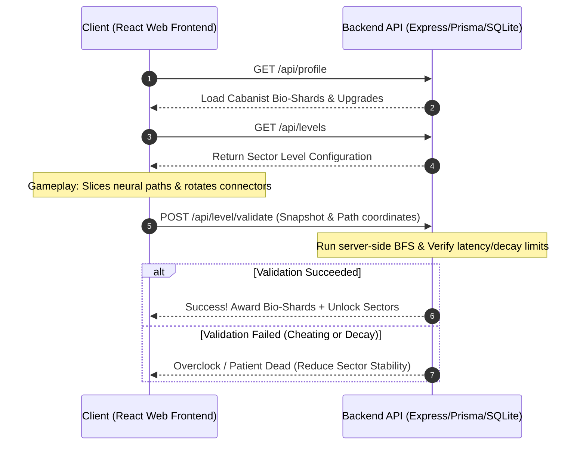

# 🧠 Neural-Carthage: Bio-Architect

[](https://react.dev/)
[](https://www.typescriptlang.org/)
[](https://vitejs.dev/)
[](https://www.prisma.io/)
[](https://sqlite.org/)

> **"A game without juice is just an algorithm wearing skin."**  
> *— The Blind Oracle of Tanit*

Welcome, **Cabanist Bio-Architect**, to *Neural-Carthage: Bio-Architect* — a visceral, high-stakes bio-mechanical puzzle game. 

In this alternate-history antiquity, Carthage did not fall. Instead, the empire discovered **Tanit's Fluid**—an organic cybernetic energy source found in deep coastal reefs. Splicing clay, weathered sandstone, hammered bronze, and biological tissue, Carthage constructed the first bio-digital hive mind. You must operate on citizens, priests, and bio-digital entities to optimize the neural network under severe temporal and physical constraints.

---

## 🏛️ Lore & Design Pillars

- **Neoclassical Punic Med-Tech Aesthetic:** Visceral dark fantasy meets high-precision medical UI. Weathered sandstone, hammered bronze frames, and organic tissues contrast with glowing cybernetic cyan energy lines.
- **Decay vs. Overclocking:** Balance temporal pressure (Subject Vitality ticking down) against computational constraints (Neural Load accumulating latency).
- **Risk-Reward Splicing:** Pathfind basic connections for simple completion, or take sub-optimal branches to harvest rare **Bio-Shard** caches.

---

## 🎮 Game Mechanics (The Surgery Chamber)

The core puzzle gameplay is located in the **Surgery Chamber** circular bio-mechanical viewport:

1. **Hexagonal Grid System:** A hexagonal matrix representing brain tissue. Connections support 6-directional routing (0°, 60°, 120°, 180°, 240°, 300°).
   - **Input Node (Brain Stem):** Cybernetic cyan energy entry point.
   - **Output Node (Organ/Implant):** Target destination.
   - **Healthy Tissue:** Empty tiles where connectors are placed.
   - **Blocked (Sandstone/Bone):** Impassable tiles that must be cleared with a Laser Scalpel.
   - **Corrupted Tissue:** Accelerates vitality decay.
   - **Bio-Shard Cache Node:** Optional high-value nodes.
2. **Dual-Constraint System:**
   - **Subject Vitality (%):** Ticks down over time. If it reaches `0%`, the procedure fails.
   - **Neural Load (MS/Ph):** Latency cost of placed components (Straight: `10`, Curve 60°: `15`, Curve 120°: `20`, Split-Y: `30` MS/Ph). Every rotation adds a `+5` MS/Ph friction penalty. Exceeding `maxNeuralLoad` triggers instant systemic overclock.
3. **Tactical Surgical Tools:**
   - 🔴 **Laser Scalpel:** Clears Blocked tiles.
   - 🟤 **Suture Needle:** Locks a connector to prevent accidental rotation/deletion.
   - 🔵 **Chemical Injector:** Freezes the Vitality decay timer for 5 seconds.

---

## 🗺️ Sector & Difficulty Progression

| Sector Name | Grid Size | Core Mechanic Intro | Dominant Hazard / Theme | Typical $L_{max}$ |
| :--- | :--- | :--- | :--- | :--- |
| **Sector 01: The Cothon Slums** | 5x5 | Flow mechanics, basic decay | Infected Workers & Servitors | $120 \text{ MS/Ph}$ |
| **Sector 02: Byrsa Citadel** | 7x7 | Leaking Synapses (open endpoints double decay) | Corrupted Legionary Sentinels | $250 \text{ MS/Ph}$ |
| **Sector 03: The Oracle Core** | 9x9 / 11x11 | Shifting Corruption & Shrouded Grid | Shifting Necrotic Clouds / Priests | $450 \text{ MS/Ph}$ |

---

## 🛠️ System Architecture

*Neural-Carthage* features a secure **client-server architecture** with cryptographic path validation:



---

## 📁 Project Structure

```
├── backend/                   # TypeScript Express server
│   ├── prisma/                # SQLite database and Prisma Schema
│   │   ├── dev.db             # Local SQLite database
│   │   └── schema.prisma      # Prisma model definitions
│   └── src/
│       ├── server.ts          # Express API server (profiles, upgrades, inventory)
│       └── validator.ts       # Path Adjacency & BFS validation engine
├── frontend/                  # React + Vite client app
│   ├── public/
│   └── src/
│       ├── App.tsx            # Main game views (Map, Upgrade Tree, Surgery Chamber)
│       ├── index.css          # Punic Cyberpunk CSS styling & animations
│       └── main.tsx           # React bootstrap entry point
├── GDD.md                     # Game Design Document
├── improvements.md            # UX & Visual "Juice" roadmap
└── technical_specification.md  # System Architecture details
```

---

## 🚀 Setup & Installation

Follow these steps to run both backend and frontend applications locally:

### 1. Prerequisites
- **Node.js** (v18 or higher recommended)
- **npm** (v9 or higher)

### 2. Run the Backend API Server

First, install dependencies and configure the database inside the `backend` directory:

```bash
# Navigate to backend
cd backend

# Install dependencies
npm install

# Run database migrations and generate Prisma client
npm run prisma:migrate
npm run prisma:generate

# Start the server in Development mode
npm run dev
```

The backend server boots and listens on **`http://localhost:3001`**, automatically seeding default level configurations and the starting player profile (`cabanist_1`).

### 3. Run the Frontend React Application

Open a new terminal window to start the client dev server:

```bash
# Navigate to frontend
cd frontend

# Install dependencies
npm install

# Start Vite Dev Server
npm run dev
```

Open your browser and navigate to **`http://localhost:5173`** (or the URL printed in your terminal).

---

## 🔧 Recent Updates & Future Roadmap

- **Procedural Surgery Chamber Navigation:** Implemented navigation actions directly in the Surgery Chamber header bar:
  - `← MAP` Button: Safely aborts the procedure and redirects back to the neural map selection screen.
  - `↻ RESTART` Button: Resets the current level simulation, reinitializing coordinates and resetting the vitality timer.
- For planned improvements regarding Web Audio API integration, animated connector placement, and custom theme layouts per sector, refer to [improvements.md](file:///Users/wecraft/Desktop/WORK/puzzle-game/improvements.md).
