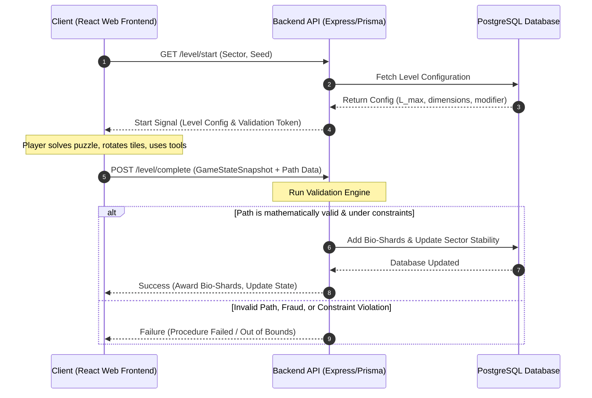

# Technical Implementation Specification
## Project Name: Neural-Carthage: Bio-Architect

---

## 0. Game Overview

*Neural-Carthage: Bio-Architect* is a bio-punk puzzle game where players act as organic architects, constructing neural pathways within living tissue to restore a dying bio-organic city. Each puzzle is a "procedure" — a hex-grid surgical tableau where players route neural signals from Input Stems to Target Organs by placing and rotating connector tiles, using surgical tools, and managing the twin resources of Neural Load and Tissue Vitality.

**Core Themes:** Organic architecture, bio-punk aesthetics, surgical precision, resource trade-offs.

---

## 1. Gameplay Design & Core Loop

### 1.1 Macro Loop (The City of Carthage)

Between puzzles, players exist in the **City of Carthage** — a bio-organic hub rendered as an interactive 2D map of sectors (organs/districts).

- **Sector Map Navigation:** Players see a stylized anatomical map with distinct sectors (e.g., Cortex, Heart-Lung Complex, Gut-Memory Vault). Each sector has a **Stability Score** (0–100) that degrades over real time or through failed procedures.
- **Temple of Tanit (Upgrade Hub):** Players spend **Bio-Shards** (earned from successful procedures) on permanent upgrades:
  - **MAX_LOAD_BUFFER:** Increases the Neural Load budget per puzzle.
  - **DIAGNOSTIC_PRECISION:** Reveals hidden tile information (e.g., corruption weight, connector hints).
  - **TOOL_EFFICIENCY:** Reduces tool cooldowns or increases tool capacity.
  - **VITALITY_BOOST:** Starts procedures with higher base Vitality.
- **Inventory Management:** The hot-bar inventory stores consumable tools (Scalpels, Sutures, Injectors). Players craft or purchase them between runs.
- **Narrative Beats:** Completing key sector procedures unlocks lore fragments, new sectors, and story progression about Carthage's fall.

### 1.2 Micro Loop (The Puzzle)

Each procedure is a hex-grid puzzle with specific win/loss conditions:

1. **Start:** Player selects a sector and difficulty seed → server generates a level configuration and returns the initial grid.
2. **Observe:** The grid is partially pre-populated with fixed INPUT/OUTPUT tiles, BLOCKED cells, CORRUPTED nodes, and SHARD_CACHE pickups.
3. **Construct:** Player **places** connector tiles (STRAIGHT, CURVE_60, CURVE_120, SPLIT_Y) on empty HEALTHY tiles and **rotates** them to form a continuous path from INPUT to OUTPUT.
4. **Surgically Intervene:** Player uses tools to modify the grid:
   - **LASER_SCALPEL:** Cuts and removes a placed connector tile (refunds partial Neural Load).
   - **SUTURE_NEEDLE:** Locks a tile in place, preventing it from shifting (used in shifting grids).
   - **CHEMICAL_INJECTOR:** Temporarily freezes the Vitality decay clock for 5 seconds.
5. **Validate & Submit:** Player submits their solution. The server validates the path and awards Bio-Shards based on remaining Vitality, Neural Load margin, and time bonus.
6. **Fail Conditions:**
   - Vitality drops to 0% (tissue death).
   - Neural Load exceeds the maximum budget (overclock meltdown).
   - No valid continuous path from INPUT to OUTPUT.

### 1.3 Puzzle Mechanics

| Mechanic | Description |
|---|---|
| **Connector Types** | 4 shapes with different open-direction profiles and Neural Load costs (STRAIGHT: 10, CURVE_60: 15, CURVE_120: 20, SPLIT_Y: 30). |
| **Rotation** | Each tile can be rotated in 60° increments (6 positions). Rotation adds a +2 Neural Load friction penalty per turn. |
| **Vitality Decay** | Vitality continuously decays at `baseDecayRate %/s` during active play. Decay accelerates by +25% per CORRUPTED node connected in the path. |
| **Shifting Grid** | In higher-level sectors, tiles randomly shift their rotation on a timer unless locked with a SUTURE_NEEDLE. |
| **SHARD_CACHE** | Special grid tiles that grant bonus Bio-Shards if included in the final path, at the cost of additional Neural Load. |
| **Tool Limits** | Each level caps Scalpel cuts and Suture locks. The CHEMICAL_INJECTOR has a global limit of 3 per procedure. |

### 1.4 Scoring & Rewards

- **Base Award:** Fixed Bio-Shard reward for completing the level.
- **Vitality Bonus:** `finalVitality * multiplier` — rewards efficient, fast solutions.
- **Neural Load Margin:** `(maxLoad - usedLoad) * multiplier` — rewards low-load optimization.
- **Speed Bonus:** `max(0, parTime - elapsedSeconds) * multiplier` — rewards quick execution.
- **SHARD_CACHE Collection:** Bonus per cache node included in the path.

---

## 2. User Interface & User Experience

### 2.1 Screen Flow

```
Title Screen → City Map (Sector Select) → Pre-Procedure Briefing → Puzzle Grid → Results Screen → City Map
```

### 2.2 Key UI Screens

#### Title Screen
- Animated bio-punk logo with organic particle effects.
- "Continue" / "New Game" / "Options" buttons.
- Ambient pulsing background (animated tissue textures).

#### City Map Screen
- Isometric/stylized 2D view of the organic city-superorganism.
- Sectors rendered as glowing anatomical nodes connected by vein-like pathways.
- Each sector shows: name, Stability Score, lock status, and reward preview.
- Clicking a sector opens a brief tooltip with difficulty rating and recommended upgrades.
- Bottom bar: Bio-Shard wallet, Inventory shortcut, Upgrade Shop (Temple of Tanit).

#### Pre-Procedure Briefing
- Animated diagram showing the target sector anatomy.
- Parameters displayed: grid dimensions, Neural Load limit, allowed tools, shift flag.
- "Begin Procedure" button with a 3-2-1 countdown transition.

#### Puzzle Grid (Main Gameplay Screen)

**Layout (mobile-first responsive):**

```
┌──────────────────────────────────────────────┐
│  ██ Header Bar █████████████████████████████  │  ← Vitality bar (left), Neural Load bar (right),
│  Vitality [████████░░] 82%   Load [███░░] 45%│     level title, timer
├──────────────────────────────────────────────┤
│                                              │
│              Hex Grid Viewport                │  ← SVG-rendered hex grid, pinch-zoom,
│          (drag to pan, scroll to zoom)         │     tap-to-select, drag-to-pan
│                                              │
│                                              │
├──────────────────────────────────────────────┤
│  [SHARD_CACHE x3]  [LASER_SCALPEL x2]        │  ← Hot-bar: tool inventory with count badges
│  [SUTURE_NEEDLE x1]  [CHEM_INJECTOR x1]      │
├──────────────────────────────────────────────┤
│  [STRAIGHT] [CURVE_60] [CURVE_120] [SPLIT_Y] │  ← Tile palette (draggable or tap-to-place)
│  Cost: 10     15       20        30          │
├──────────────────────────────────────────────┤
│  [UNDO]  [RESET]  [SUBMIT]                   │  ← Action bar
└──────────────────────────────────────────────┘
```

**Interaction Design:**
- **Tap a tile on the palette** → places it on the selected grid cell.
- **Tap an empty grid cell** → selects it; if a tile type is active, places it there.
- **Tap a placed tile** → selects it; shows rotation controls.
- **Rotation:** Two arrow buttons appear over the selected tile (↻ ↺) for 60° increments. Alternatively, right-click or long-press to rotate.
- **Tool Use:** Tap a tool in the hot-bar, then tap a target tile to apply it.
- **Undo:** Reverts the last action (with a limit of 50 undo steps stored client-side).
- **Reset:** Resets the entire grid to its initial state (confirmation dialog).
- **Submit:** Sends the solution to the server for validation.

**Visual Feedback:**
- **Valid path preview:** As tiles are placed, a semi-transparent "signal pulse" animates along connected paths from INPUT toward OUTPUT.
- **Invalid placement:** Red glow + shake animation when a tile cannot be placed.
- **Vitality warning:** Screen vignette darkens and pulses red when Vitality drops below 25%.
- **Neural Load warning:** Load bar changes color (green → yellow → red) as it approaches the limit.
- **Tool activation:** Screen flash + sound effect per tool use.
- **Corruption spread:** CORRUPTED tiles emit a dark, pulsing aura that intensifies when connected.

#### Results Screen
- Animated score breakdown (Vitality bonus, Load margin, Speed bonus, Shard collection).
- Total Bio-Shards earned with a "ka-ching" animation.
- "Retry" / "Next Level" / "Return to City" buttons.
- If failed: shows the fail reason (Vitality depleted, Load exceeded, No path).

### 2.3 UX Principles

- **Onboarding:** First 3 levels are guided tutorials with highlighted UI elements and tooltip text.
- **Progressive Disclosure:** Advanced mechanics (shifting grids, CHEMICAL_INJECTOR) are introduced one at a time with tutorial levels.
- **Feedback Density:** Every action produces a visual + audio confirmation. Errors are communicated clearly (not just silently rejected).
- **Accessibility:**
  - Colorblind mode: Connector tiles use shape + pattern, not just color.
  - High-contrast grid lines.
  - Optional reduced-motion toggle.
  - Keyboard navigation (arrow keys to move selection, R to rotate, 1-4 for palette, 5-8 for tools).
- **Mobile Support:** Touch-optimized hit targets (minimum 44px). Pinch-to-zoom and drag-to-pan on the grid.

### 2.4 Animation & Transition Catalogue

| Context | Animation | Duration |
|---|---|---|
| Screen transitions | Organic "cell division" morph (tiles dissolve and reform) | 400ms |
| Tile placement | Scale bounce-in (0 → 1.1 → 1.0) with slight overshoot | 200ms |
| Tile rotation | Smooth 60° rotation tween | 150ms |
| Path validation | Pulsing signal travels along connected path at 2 tiles/sec | per path |
| Tool use | Screen tint flash + tile-specific particle burst | 300ms |
| Score tally | Number count-up with easing | 800ms |
| Vitality critical | Screen vignette pulse, heartbeat overlay | looping |
| Level complete | Slow-motion zoom into the final path, particle celebration | 1.5s |

---

## 3. Level Design & Progression

### 3.1 Difficulty Curve

The game is structured into **Sectors**, each containing multiple **Levels** (procedures). Difficulty scales across three axes:

| Axis | Early Game (Sector 1) | Mid Game (Sector 2–3) | Late Game (Sector 4–5) |
|---|---|---|---|
| **Grid Size** | 5×5 to 6×6 | 7×7 to 9×9 | 10×10 to 12×12 |
| **BLOCKED Cells** | 0–2 | 3–6 | 7–12 |
| **CORRUPTED Nodes** | 0 | 1–3 | 3–6 |
| **Neural Load Budget** | Generous (2× typical need) | Tight (1.3× typical need) | Constrained (1.1× typical need) |
| **Tools Allowed** | No tools needed | Scalpel (1–2) + Suture (1) | All tools, limited uses |
| **Shifting Grid** | No | Occasionally (Sector 3+) | Frequent |
| **SHARD_CACHE** | None | 1–2 per level | 2–4 per level |
| **Par Time** | 120s | 90s | 60s |

### 3.2 Tutorial Sequence (First 5 Levels)

1. **Level T1 — "First Incision" (5×5):** Fixed INPUT and OUTPUT directly in line. Player places **one STRAIGHT** tile. No tools, no decay. Fully guided with UI highlights.
2. **Level T2 — "Learn to Turn" (5×5):** INPUT and OUTPUT are offset. Player must place a **CURVE_60** or **CURVE_120** tile. Rotation controls are introduced.
3. **Level T3 — "Split Decision" (5×5):** Introduces SPLIT_Y and the concept of multiple possible paths. Simple branching with one BLOCKED cell.
4. **Level T4 — "Against the Clock" (6×6):** Vitality decay is introduced. Player learns speed vs. optimization trade-off.
5. **Level T5 — "First Tool" (6×6):** First BLOCKED cell that must be removed with LASER_SCALPEL. Tool tutorial overlay.

### 3.3 Sector Themes & Visual Identity

| Sector | Theme | Color Palette | Special Mechanic Introduced |
|---|---|---|---|
| **Cortex** (Sector 1) | Neural pathways, bright synapses | Blue/Cyan/White | Baseline mechanics |
| **Heartwood** (Sector 2) | Vascular bundles, organic pumps | Red/Crimson/Gold | Vitality decay severity increases |
| **Gut-Vault** (Sector 3) | Dense tangled tissue, memory storage | Green/Teal/Amber | Shifting grids, SHARD_CACHE |
| **Bone-Archive** (Sector 4) | Rigid calcified structures | Ivory/Umber/Slate | CORRUPTED nodes proliferate |
| **Core-Nexus** (Sector 5) | Central command, final convergence | Violet/White/Black | All mechanics combined at maximum intensity |

### 3.4 Puzzle Generation Strategy

Levels are **seeded procedural** — the seed determines the grid layout, INPUT/OUTPUT positions, BLOCKED/CORRUPTED placement, and tool allowances.

**Generation algorithm outline:**
1. **Place INPUT** on a border or near-border cell.
2. **Place OUTPUT** on the opposite side of the grid (distance scales with difficulty).
3. **Generate a solution skeleton:** A* pathfinding across hex grid with minimal connector cost (the "intended path").
4. **Add noise:** Place BLOCKED cells near the intended path to force detours. Place CORRUPTED nodes as "trap" alternative routes.
5. **Place SHARD_CACHE** nodes off the intended path to tempt the player with a risk/reward choice.
6. **Determine tool budget** based on number of BLOCKED tiles and grid complexity.
7. **Set baseDecayRate** inversely proportional to expected optimal path length (shorter par = faster decay).

The same seed always generates the same level configuration, allowing players to share seeds or replay for optimization.

### 3.5 Post-Game / Replayability

- **Par Time Challenges:** Each level records the player's best time. Beating the par time awards a bonus badge.
- **Low-Load Challenges:** Complete a level with Neural Load under a certain threshold for an optimization badge.
- **No-Tool Challenges:** Complete levels without using any tools (where possible).
- **Daily Procedure:** A unique seed generated each day with leaderboard rankings.
- **Seed Sharing:** Players can share seed codes with friends to compete on identical puzzles.

---

## 4. Narrative & World-Building

### 4.1 Setting

The city of **Carthage** was a living super-organism — a symbiotic metropolis grown from a single bio-engineered seed. Centuries of exploitation and entropy have caused its organic systems to decay. As the last **Bio-Architect**, the player must navigate Carthage's dying anatomy, performing surgical procedures to stabilize its organs and uncover the truth of its collapse.

### 4.2 Lore Delivery

- **Sector Intro Cutscenes:** Brief animated sequences when entering a new sector for the first time.
- **Lore Fragments:** Unlocked by completing specific levels within a sector. Presented as "memory echoes" — text with atmospheric illustration.
- **NPCs:** Rare encounters with surviving bio-dwellers who offer context, tips, and side objectives.
- **Environmental Storytelling:** The grid tiles themselves carry narrative flavor — CORRUPTED nodes show scar tissue from past traumas, SHARD_CACHE nodes glisten with fragmented memories.

### 4.3 Tone

- **Visual:** Organic/biopunk — think *Scorn* meets *Journey* meets *The Expanse*'s protomolecule.
- **Audio:** Ambient dronescapes with organic percussion. Heartbeat pulse tied to Vitality. Metallic/biological tool sounds.
- **Writing:** Minimal but evocative. Short phrases, medical/anatomical terminology blended with poetic abstraction.

---

## 5. Visual & Audio Design

### 5.1 Art Direction

- **Style:** 2D vector illustration with hand-drawn aesthetic. SVG-based rendering for crisp scaling.
- **Color Treatment:** Desaturated organic base tones with saturated neon accents (neural signals, corruption, tool effects).
- **Tile Design:** Each connector type has a distinct silhouette and internal pattern. STRAIGHT = clean line, CURVE_60 = gentle arc, CURVE_120 = sharp bend, SPLIT_Y = branching vein.
- **Backgrounds:** Subtle animated organic textures (breathing, pulsing, cell movement) behind the grid.
- **Particles:** Neural signals travel along completed paths as glowing dot streams. Tool effects produce tile-specific particle bursts.

### 5.2 Sound Design

| Context | Sound |
|---|---|
| Tile place | Soft organic "click" — cartilage settling |
| Tile rotate | Wet "schlip" — tendon twisting |
| Tool: Scalpel | High-frequency "sizzle" + tissue tear |
| Tool: Suture | Needle puncturing leather |
| Tool: Injector | Pneumatic hiss + liquid squelch |
| Vitality low | Low heartbeat thump, increasing frequency |
| Level complete | Ascending chime + ambient swell |
| Level fail | Dissonant tone drop + flatline beep |
| UI hover | Subtle bio-organic blip |
| UI confirm | Resonant organic chord |

- **Ambient Music:** Dynamic system with layers that build based on player activity. Calm drone during planning → percussive elements during active placement → intensity spike during low Vitality.
- **Voice:** No voice acting. All narrative delivered through text and environmental audio.

### 5.3 Performance Targets

- **Desktop:** 60fps at 1920×1080, WebGL2 or Canvas2D fallback.
- **Mobile:** 30fps minimum on devices from 2019+, touch input latency < 50ms.
- **Load Times:** Initial bundle < 2MB (gzipped). Level generation < 500ms.
- **Memory:** Grid states limited to 144 cells (12×12 max). Action log limited to 2000 entries.

---

## 6. Systems Architecture

The game utilizes a split client-server architecture:
*   **Client (React / Vite):** The React frontend handles the macro loop UI (Dashboard, Inventory, Upgrades), sector map navigation, and the SVG-based hex grid rendering, user interaction, and sound design.
*   **Backend (TypeScript, Node.js/Prisma):** Exposes REST/GraphQL API endpoints for state synchronizations, upgrades purchases, and game state validation.
*   **Validation Engine:** A secure, server-side TypeScript service that checks player submissions before updating their database record.



---

## 7. Database Schema (Prisma/PostgreSQL)

Below is the Prisma schema representing the core state management entities:

```prisma
datasource db {
  provider = "postgresql"
  url      = env("DATABASE_URL")
}

generator client {
  provider = "prisma-client-id"
}

/// Represents the user's progress, credentials, and global wallet.
model UserProfile {
  id              String             @id @default(uuid())
  username        String             @unique
  bioShards       Int                @default(0)
  activeSectorId  String             @default("sector_01")
  unlockedSectors String[]           // Array of sector identifiers: ["sector_01", "sector_02"]
  createdAt       DateTime           @default(now())
  updatedAt       DateTime           @updatedAt
  
  // Relations
  inventory       UserInventoryItem[]
  upgrades        UserUpgrade[]
  snapshots       GameStateSnapshot[]
  sectorStability SectorStability[]
}

/// Represents individual items in the user's hot-bar inventory.
model UserInventoryItem {
  id             String      @id @default(uuid())
  userProfileId  String
  itemType       String      // e.g., "LASER_SCALPEL", "SUTURE_NEEDLE", "CHEMICAL_INJECTOR"
  quantity       Int         @default(0)
  
  // Relations
  userProfile    UserProfile @relation(fields: [userProfileId], references: [id], onDelete: Cascade)

  @@unique([userProfileId, itemType])
}

/// Global upgrade records purchased in the Temple of Tanit.
model UserUpgrade {
  id             String      @id @default(uuid())
  userProfileId  String
  upgradeKey     String      // e.g., "MAX_LOAD_BUFFER", "DIAGNOSTIC_PRECISION", "TOOL_EFFICIENCY"
  tier           Int         @default(0) // Tier Level (0 to 5)

  // Relations
  userProfile    UserProfile @relation(fields: [userProfileId], references: [id], onDelete: Cascade)

  @@unique([userProfileId, upgradeKey])
}

/// Tracks the Stability Factor of each sector for a specific user.
model SectorStability {
  id             String      @id @default(uuid())
  userProfileId  String
  sectorId       String      // e.g., "sector_01", "sector_02", "sector_03"
  stabilityScore Float       @default(100.0) // 0.0 to 100.0

  // Relations
  userProfile    UserProfile @relation(fields: [userProfileId], references: [id], onDelete: Cascade)

  @@unique([userProfileId, sectorId])
}

/// Config representation for level generation logic.
model LevelConfiguration {
  id               String   @id @default(uuid())
  sectorId         String   // "sector_01", "sector_02", "sector_03"
  levelNumber      Int
  seed             Int      // 32-bit generator seed
  width            Int      // Grid columns
  height           Int      // Grid rows
  maxNeuralLoad    Int      // Max MS/Ph allowed
  baseDecayRate    Float    // Vitality decay percentage per second
  allowedScalpels  Int      @default(0)
  allowedSutures   Int      @default(0)
  isShifting       Boolean  @default(false)
  createdAt        DateTime @default(now())
}

/// Record of completed runs submitted by players to prove solution validity.
model GameStateSnapshot {
  id              String   @id @default(uuid())
  userProfileId   String
  levelId         String
  seed            Int
  elapsedSeconds  Float
  finalVitality   Float
  finalNeuralLoad Int
  actionsLog      Json     // Array of player interactions: rotations, placements, tool use
  gridCoordinates Json     // Grid layout coordinates containing placed connectors
  isValidated     Boolean  @default(false)
  createdAt       DateTime @default(now())

  // Relations
  userProfile     UserProfile @relation(fields: [userProfileId], references: [id], onDelete: Cascade)
}
```

---

## 8. TypeScript Interfaces

The following declarations specify the structures passed over the network:

```typescript
export type TileType = 'INPUT' | 'OUTPUT' | 'HEALTHY' | 'BLOCKED' | 'CORRUPTED' | 'SHARD_CACHE';
export type ConnectorType = 'STRAIGHT' | 'CURVE_60' | 'CURVE_120' | 'SPLIT_Y' | 'NONE';

/**
 * Directional values representing the 6 angles of a hex tile.
 * Indexing: 0 = North, 1 = North-East, 2 = South-East, 3 = South, 4 = South-West, 5 = North-West.
 */
export type HexDirection = 0 | 1 | 2 | 3 | 4 | 5;

export interface HexGridCoordinate {
  q: number; // axial coordinates q (column)
  r: number; // axial coordinates r (row)
}

export interface GridTile {
  q: number;
  r: number;
  type: TileType;
  connector: ConnectorType;
  rotation: HexDirection; // Active orientation of the connector
  isLocked: boolean;     // True if a suture needle has locked this tile
}

export interface PlayerAction {
  timestampMs: number;
  actionType: 'PLACE' | 'ROTATE' | 'DELETE' | 'TOOL_SCALPEL' | 'TOOL_SUTURE' | 'TOOL_INJECTOR';
  q: number;
  r: number;
  param?: string | number; // e.g., tile rotation index or tool count
}

export interface GameStateSnapshotDto {
  levelId: string;
  seed: number;
  grid: GridTile[];
  actions: PlayerAction[];
  elapsedSeconds: number;
  finalVitality: number;
  finalNeuralLoad: number;
}
```

---

## 9. Server-Side Path Validation Engine

To maintain structural security, the server-side validator reconstructs the grid, iterates actions, and runs a breadth-first search (BFS) traversal along the hexagonal coordinates.

### 9.1 Hexagonal Adjacency Mechanics
In axial coordinates $(q, r)$, the six possible directions from cell $(q, r)$ are defined by the vector offsets:
$$\Delta = [(0, -1), (1, -1), (1, 0), (0, 1), (-1, 1), (-1, 0)]$$

A connection is valid between adjacent tiles $A$ and $B$ only if:
1.  Tile $A$'s connector shape oriented at rotation $\theta_A$ exposes an outlet pointing toward Tile $B$.
2.  Tile $B$'s connector shape oriented at rotation $\theta_B$ exposes an inlet pointing toward Tile $A$.

### 9.2 Math Validation Algorithm

```typescript
import { GameStateSnapshotDto, GridTile, HexDirection, PlayerAction, ConnectorType } from './interfaces';

// Axial directions: N, NE, SE, S, SW, NW
const HEX_DIRECTIONS = [
  { dq: 0, dr: -1 },
  { dq: 1, dr: -1 },
  { dq: 1, dr: 0 },
  { dq: 0, dr: 1 },
  { dq: -1, dr: 1 },
  { dq: -1, dr: 0 }
];

/**
 * Returns local directional offsets that are open for a given connector configuration.
 * A returned index maps to a HexDirection.
 */
export function getOpenDirections(type: ConnectorType, rotation: HexDirection): Set<HexDirection> {
  const open = new Set<HexDirection>();
  if (type === 'NONE') return open;

  // Directions relative to rotation (0)
  let localDirs: HexDirection[] = [];
  switch (type) {
    case 'STRAIGHT':
      localDirs = [0, 3]; // North and South
      break;
    case 'CURVE_60':
      localDirs = [0, 1]; // North and North-East
      break;
    case 'CURVE_120':
      localDirs = [0, 2]; // North and South-East
      break;
    case 'SPLIT_Y':
      localDirs = [0, 2, 4]; // Inlets distributed every 120 degrees
      break;
  }

  // Rotate local directions
  for (const dir of localDirs) {
    const rotated = ((dir + rotation) % 6) as HexDirection;
    open.add(rotated);
  }
  return open;
}

export function validateSolution(
  snapshot: GameStateSnapshotDto,
  config: { maxNeuralLoad: number; baseDecayRate: number; allowedScalpels: number; allowedSutures: number }
): { isValid: boolean; reason?: string } {
  
  // 1. Verify Action Log Chronology
  let lastTime = 0;
  let scalpelsUsed = 0;
  let suturesUsed = 0;
  let injectorFreezes = 0;

  for (const action of snapshot.actions) {
    if (action.timestampMs < lastTime) {
      return { isValid: false, reason: 'Chronological timeline mismatch in player logs.' };
    }
    lastTime = action.timestampMs;

    if (action.actionType === 'TOOL_SCALPEL') scalpelsUsed++;
    if (action.actionType === 'TOOL_SUTURE') suturesUsed++;
    if (action.actionType === 'TOOL_INJECTOR') injectorFreezes++;
  }

  // 2. Validate Surgical Tool Limit Overruns
  if (scalpelsUsed > config.allowedScalpels) {
    return { isValid: false, reason: `Excessive Laser Scalpel uses: ${scalpelsUsed} > limit of ${config.allowedScalpels}` };
  }
  if (suturesUsed > config.allowedSutures) {
    return { isValid: false, reason: `Excessive Suture Needle locks: ${suturesUsed} > limit of ${config.allowedSutures}` };
  }

  // 3. Map Grid coordinates for rapid axial lookup
  const gridMap = new Map<string, GridTile>();
  let inputNode: GridTile | null = null;
  let outputNode: GridTile | null = null;

  for (const tile of snapshot.grid) {
    const key = `${tile.q},${tile.r}`;
    gridMap.set(key, tile);
    if (tile.type === 'INPUT') inputNode = tile;
    if (tile.type === 'OUTPUT') outputNode = tile;
  }

  if (!inputNode || !outputNode) {
    return { isValid: false, reason: 'Input Stem or Output Organ Node missing in grid matrix.' };
  }

  // 4. Calculate Final Neural Load & Verify Budget
  let calculatedLoad = 0;
  for (const tile of snapshot.grid) {
    if (tile.connector === 'NONE') continue;
    
    // Core connector component latencies
    if (tile.connector === 'STRAIGHT') calculatedLoad += 10;
    else if (tile.connector === 'CURVE_60') calculatedLoad += 15;
    else if (tile.connector === 'CURVE_120') calculatedLoad += 20;
    else if (tile.connector === 'SPLIT_Y') calculatedLoad += 30;
  }

  // Add transient friction penalty for action rotations
  const rotationsCount = snapshot.actions.filter(a => a.actionType === 'ROTATE').length;
  calculatedLoad += rotationsCount * 2;

  if (calculatedLoad !== snapshot.finalNeuralLoad) {
    return { isValid: false, reason: `Neural Load mismatch. Reported: ${snapshot.finalNeuralLoad}, Calculated: ${calculatedLoad}` };
  }

  if (calculatedLoad > config.maxNeuralLoad) {
    return { isValid: false, reason: `Neural Load exceeds overclock threshold: ${calculatedLoad} > limit of ${config.maxNeuralLoad}` };
  }

  // 5. Calculate Vitality Degradation timeline
  const activePlayDuration = snapshot.elapsedSeconds;
  const freezeCreditsDuration = injectorFreezes * 5.0; // 5 seconds freeze per injector
  const decayingDuration = Math.max(0, activePlayDuration - freezeCreditsDuration);
  
  // Find connected corruption tiles to apply decay acceleration
  const corruptionWeight = 0.25; // +25% decay speed per connected corrupted node
  let corruptionMultiplier = 1.0;

  // Track connected path elements
  const visited = new Set<string>();
  const queue: GridTile[] = [inputNode];
  visited.add(`${inputNode.q},${inputNode.r}`);

  let pathConnectsToOutput = false;

  while (queue.length > 0) {
    const current = queue.shift()!;
    if (current.type === 'OUTPUT') {
      pathConnectsToOutput = true;
    }
    if (current.type === 'CORRUPTED') {
      corruptionMultiplier += corruptionWeight;
    }

    const currentKey = `${current.q},${current.r}`;
    const openDirs = getOpenDirections(current.connector, current.rotation);

    // If it's the input or output node, allow general routing from any neighboring connection
    if (current.type === 'INPUT') {
      // Input stem broadcasts outwards in all 6 directions
      for (let i = 0; i < 6; i++) openDirs.add(i as HexDirection);
    }

    for (const dirIndex of openDirs) {
      const dir = HEX_DIRECTIONS[dirIndex];
      const nextQ = current.q + dir.dq;
      const nextR = current.r + dir.dr;
      const nextKey = `${nextQ},${nextR}`;

      if (visited.has(nextKey)) continue;

      const neighbor = gridMap.get(nextKey);
      if (neighbor) {
        // Output node accepts path inputs from any direction
        if (neighbor.type === 'OUTPUT') {
          visited.add(nextKey);
          queue.push(neighbor);
          continue;
        }

        // Check if neighbor opens back toward current tile
        const neighborOpenDirs = getOpenDirections(neighbor.connector, neighbor.rotation);
        const inverseDir = ((dirIndex + 3) % 6) as HexDirection;

        if (neighborOpenDirs.has(inverseDir)) {
          visited.add(nextKey);
          queue.push(neighbor);
        }
      }
    }
  }

  // Verify vitality depletion
  const baseDecay = config.baseDecayRate * decayingDuration;
  const totalDecay = baseDecay * corruptionMultiplier;
  const calculatedVitality = Math.max(0, 100 - totalDecay);

  if (calculatedVitality <= 0) {
    return { isValid: false, reason: `Subject Vitality depleted to 0% during procedure.` };
  }

  if (Math.abs(calculatedVitality - snapshot.finalVitality) > 1.5) {
    return { isValid: false, reason: `Vitality mismatch. Client reported ${snapshot.finalVitality}%, Server calculated ${calculatedVitality}%` };
  }

  // 6. Final connection check
  if (!pathConnectsToOutput) {
    return { isValid: false, reason: 'No closed, continuous pathway connects Input Stem to Target Organ.' };
  }

  return { isValid: true };
}
```
