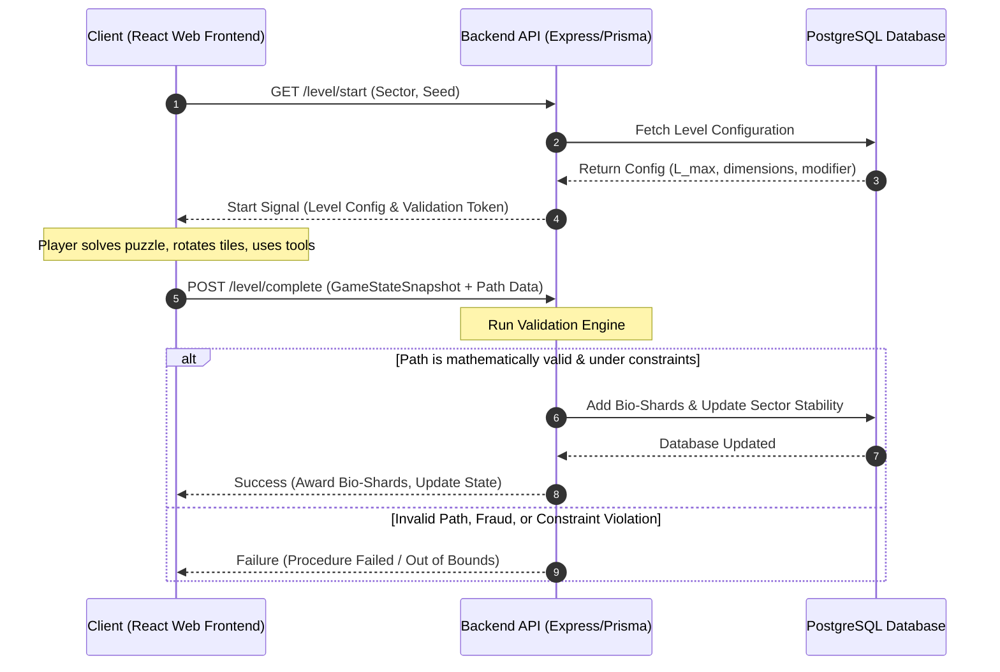

# Technical Implementation Specification
## Project Name: Neural-Carthage: Bio-Architect

---

## 1. Systems Architecture

The game utilizes a split client-server architecture:
*   **Client (React / Vite):** The React frontend handles the macro loop UI (Dashboard, Inventory, Upgrades), sector map navigation, and the SVG-based hex grid rendering, user interaction, and sound design.
*   **Backend (TypeScript, Node.js/Prisma):** Exposes REST/GraphQL API endpoints for state synchronizations, upgrades purchases, and game state validation.
*   **Validation Engine:** A secure, server-side TypeScript service that checks player submissions before updating their database record.



---

## 2. Database Schema (Prisma/PostgreSQL)

Below is the Prisma schema representing the core state management entities:

```prisma
datasource db {
  provider = "postgresql"
  url      = env("DATABASE_URL")
}

generator client {
  provider = "prisma-client-id"
}

/// Represents the user's progress, credentials, and global wallet.
model UserProfile {
  id              String             @id @default(uuid())
  username        String             @unique
  bioShards       Int                @default(0)
  activeSectorId  String             @default("sector_01")
  unlockedSectors String[]           // Array of sector identifiers: ["sector_01", "sector_02"]
  createdAt       DateTime           @default(now())
  updatedAt       DateTime           @updatedAt
  
  // Relations
  inventory       UserInventoryItem[]
  upgrades        UserUpgrade[]
  snapshots       GameStateSnapshot[]
  sectorStability SectorStability[]
}

/// Represents individual items in the user's hot-bar inventory.
model UserInventoryItem {
  id             String      @id @default(uuid())
  userProfileId  String
  itemType       String      // e.g., "LASER_SCALPEL", "SUTURE_NEEDLE", "CHEMICAL_INJECTOR"
  quantity       Int         @default(0)
  
  // Relations
  userProfile    UserProfile @relation(fields: [userProfileId], references: [id], onDelete: Cascade)

  @@unique([userProfileId, itemType])
}

/// Global upgrade records purchased in the Temple of Tanit.
model UserUpgrade {
  id             String      @id @default(uuid())
  userProfileId  String
  upgradeKey     String      // e.g., "MAX_LOAD_BUFFER", "DIAGNOSTIC_PRECISION", "TOOL_EFFICIENCY"
  tier           Int         @default(0) // Tier Level (0 to 5)

  // Relations
  userProfile    UserProfile @relation(fields: [userProfileId], references: [id], onDelete: Cascade)

  @@unique([userProfileId, upgradeKey])
}

/// Tracks the Stability Factor of each sector for a specific user.
model SectorStability {
  id             String      @id @default(uuid())
  userProfileId  String
  sectorId       String      // e.g., "sector_01", "sector_02", "sector_03"
  stabilityScore Float       @default(100.0) // 0.0 to 100.0

  // Relations
  userProfile    UserProfile @relation(fields: [userProfileId], references: [id], onDelete: Cascade)

  @@unique([userProfileId, sectorId])
}

/// Config representation for level generation logic.
model LevelConfiguration {
  id               String   @id @default(uuid())
  sectorId         String   // "sector_01", "sector_02", "sector_03"
  levelNumber      Int
  seed             Int      // 32-bit generator seed
  width            Int      // Grid columns
  height           Int      // Grid rows
  maxNeuralLoad    Int      // Max MS/Ph allowed
  baseDecayRate    Float    // Vitality decay percentage per second
  allowedScalpels  Int      @default(0)
  allowedSutures   Int      @default(0)
  isShifting       Boolean  @default(false)
  createdAt        DateTime @default(now())
}

/// Record of completed runs submitted by players to prove solution validity.
model GameStateSnapshot {
  id              String   @id @default(uuid())
  userProfileId   String
  levelId         String
  seed            Int
  elapsedSeconds  Float
  finalVitality   Float
  finalNeuralLoad Int
  actionsLog      Json     // Array of player interactions: rotations, placements, tool use
  gridCoordinates Json     // Grid layout coordinates containing placed connectors
  isValidated     Boolean  @default(false)
  createdAt       DateTime @default(now())

  // Relations
  userProfile     UserProfile @relation(fields: [userProfileId], references: [id], onDelete: Cascade)
}
```

---

## 3. TypeScript Interfaces

The following declarations specify the structures passed over the network:

```typescript
export type TileType = 'INPUT' | 'OUTPUT' | 'HEALTHY' | 'BLOCKED' | 'CORRUPTED' | 'SHARD_CACHE';
export type ConnectorType = 'STRAIGHT' | 'CURVE_60' | 'CURVE_120' | 'SPLIT_Y' | 'NONE';

/**
 * Directional values representing the 6 angles of a hex tile.
 * Indexing: 0 = North, 1 = North-East, 2 = South-East, 3 = South, 4 = South-West, 5 = North-West.
 */
export type HexDirection = 0 | 1 | 2 | 3 | 4 | 5;

export interface HexGridCoordinate {
  q: number; // axial coordinates q (column)
  r: number; // axial coordinates r (row)
}

export interface GridTile {
  q: number;
  r: number;
  type: TileType;
  connector: ConnectorType;
  rotation: HexDirection; // Active orientation of the connector
  isLocked: boolean;     // True if a suture needle has locked this tile
}

export interface PlayerAction {
  timestampMs: number;
  actionType: 'PLACE' | 'ROTATE' | 'DELETE' | 'TOOL_SCALPEL' | 'TOOL_SUTURE' | 'TOOL_INJECTOR';
  q: number;
  r: number;
  param?: string | number; // e.g., tile rotation index or tool count
}

export interface GameStateSnapshotDto {
  levelId: string;
  seed: number;
  grid: GridTile[];
  actions: PlayerAction[];
  elapsedSeconds: number;
  finalVitality: number;
  finalNeuralLoad: number;
}
```

---

## 4. Server-Side Path Validation Engine

To maintain structural security, the server-side validator reconstructs the grid, iterates actions, and runs a breadth-first search (BFS) traversal along the hexagonal coordinates.

### 4.1 Hexagonal Adjacency Mechanics
In axial coordinates $(q, r)$, the six possible directions from cell $(q, r)$ are defined by the vector offsets:
$$\Delta = [(0, -1), (1, -1), (1, 0), (0, 1), (-1, 1), (-1, 0)]$$

A connection is valid between adjacent tiles $A$ and $B$ only if:
1.  Tile $A$'s connector shape oriented at rotation $\theta_A$ exposes an outlet pointing toward Tile $B$.
2.  Tile $B$'s connector shape oriented at rotation $\theta_B$ exposes an inlet pointing toward Tile $A$.

### 4.2 Math Validation Algorithm

```typescript
import { GameStateSnapshotDto, GridTile, HexDirection, PlayerAction, ConnectorType } from './interfaces';

// Axial directions: N, NE, SE, S, SW, NW
const HEX_DIRECTIONS = [
  { dq: 0, dr: -1 },
  { dq: 1, dr: -1 },
  { dq: 1, dr: 0 },
  { dq: 0, dr: 1 },
  { dq: -1, dr: 1 },
  { dq: -1, dr: 0 }
];

/**
 * Returns local directional offsets that are open for a given connector configuration.
 * A returned index maps to a HexDirection.
 */
export function getOpenDirections(type: ConnectorType, rotation: HexDirection): Set<HexDirection> {
  const open = new Set<HexDirection>();
  if (type === 'NONE') return open;

  // Directions relative to rotation (0)
  let localDirs: HexDirection[] = [];
  switch (type) {
    case 'STRAIGHT':
      localDirs = [0, 3]; // North and South
      break;
    case 'CURVE_60':
      localDirs = [0, 1]; // North and North-East
      break;
    case 'CURVE_120':
      localDirs = [0, 2]; // North and South-East
      break;
    case 'SPLIT_Y':
      localDirs = [0, 2, 4]; // Inlets distributed every 120 degrees
      break;
  }

  // Rotate local directions
  for (const dir of localDirs) {
    const rotated = ((dir + rotation) % 6) as HexDirection;
    open.add(rotated);
  }
  return open;
}

export function validateSolution(
  snapshot: GameStateSnapshotDto,
  config: { maxNeuralLoad: number; baseDecayRate: number; allowedScalpels: number; allowedSutures: number }
): { isValid: boolean; reason?: string } {
  
  // 1. Verify Action Log Chronology
  let lastTime = 0;
  let scalpelsUsed = 0;
  let suturesUsed = 0;
  let injectorFreezes = 0;

  for (const action of snapshot.actions) {
    if (action.timestampMs < lastTime) {
      return { isValid: false, reason: 'Chronological timeline mismatch in player logs.' };
    }
    lastTime = action.timestampMs;

    if (action.actionType === 'TOOL_SCALPEL') scalpelsUsed++;
    if (action.actionType === 'TOOL_SUTURE') suturesUsed++;
    if (action.actionType === 'TOOL_INJECTOR') injectorFreezes++;
  }

  // 2. Validate Surgical Tool Limit Overruns
  if (scalpelsUsed > config.allowedScalpels) {
    return { isValid: false, reason: `Excessive Laser Scalpel uses: ${scalpelsUsed} > limit of ${config.allowedScalpels}` };
  }
  if (suturesUsed > config.allowedSutures) {
    return { isValid: false, reason: `Excessive Suture Needle locks: ${suturesUsed} > limit of ${config.allowedSutures}` };
  }

  // 3. Map Grid coordinates for rapid axial lookup
  const gridMap = new Map<string, GridTile>();
  let inputNode: GridTile | null = null;
  let outputNode: GridTile | null = null;

  for (const tile of snapshot.grid) {
    const key = `${tile.q},${tile.r}`;
    gridMap.set(key, tile);
    if (tile.type === 'INPUT') inputNode = tile;
    if (tile.type === 'OUTPUT') outputNode = tile;
  }

  if (!inputNode || !outputNode) {
    return { isValid: false, reason: 'Input Stem or Output Organ Node missing in grid matrix.' };
  }

  // 4. Calculate Final Neural Load & Verify Budget
  let calculatedLoad = 0;
  for (const tile of snapshot.grid) {
    if (tile.connector === 'NONE') continue;
    
    // Core connector component latencies
    if (tile.connector === 'STRAIGHT') calculatedLoad += 10;
    else if (tile.connector === 'CURVE_60') calculatedLoad += 15;
    else if (tile.connector === 'CURVE_120') calculatedLoad += 20;
    else if (tile.connector === 'SPLIT_Y') calculatedLoad += 30;
  }

  // Add transient friction penalty for action rotations
  const rotationsCount = snapshot.actions.filter(a => a.actionType === 'ROTATE').length;
  calculatedLoad += rotationsCount * 2;

  if (calculatedLoad !== snapshot.finalNeuralLoad) {
    return { isValid: false, reason: `Neural Load mismatch. Reported: ${snapshot.finalNeuralLoad}, Calculated: ${calculatedLoad}` };
  }

  if (calculatedLoad > config.maxNeuralLoad) {
    return { isValid: false, reason: `Neural Load exceeds overclock threshold: ${calculatedLoad} > limit of ${config.maxNeuralLoad}` };
  }

  // 5. Calculate Vitality Degradation timeline
  const activePlayDuration = snapshot.elapsedSeconds;
  const freezeCreditsDuration = injectorFreezes * 5.0; // 5 seconds freeze per injector
  const decayingDuration = Math.max(0, activePlayDuration - freezeCreditsDuration);
  
  // Find connected corruption tiles to apply decay acceleration
  const corruptionWeight = 0.25; // +25% decay speed per connected corrupted node
  let corruptionMultiplier = 1.0;

  // Track connected path elements
  const visited = new Set<string>();
  const queue: GridTile[] = [inputNode];
  visited.add(`${inputNode.q},${inputNode.r}`);

  let pathConnectsToOutput = false;

  while (queue.length > 0) {
    const current = queue.shift()!;
    if (current.type === 'OUTPUT') {
      pathConnectsToOutput = true;
    }
    if (current.type === 'CORRUPTED') {
      corruptionMultiplier += corruptionWeight;
    }

    const currentKey = `${current.q},${current.r}`;
    const openDirs = getOpenDirections(current.connector, current.rotation);

    // If it's the input or output node, allow general routing from any neighboring connection
    if (current.type === 'INPUT') {
      // Input stem broadcasts outwards in all 6 directions
      for (let i = 0; i < 6; i++) openDirs.add(i as HexDirection);
    }

    for (const dirIndex of openDirs) {
      const dir = HEX_DIRECTIONS[dirIndex];
      const nextQ = current.q + dir.dq;
      const nextR = current.r + dir.dr;
      const nextKey = `${nextQ},${nextR}`;

      if (visited.has(nextKey)) continue;

      const neighbor = gridMap.get(nextKey);
      if (neighbor) {
        // Output node accepts path inputs from any direction
        if (neighbor.type === 'OUTPUT') {
          visited.add(nextKey);
          queue.push(neighbor);
          continue;
        }

        // Check if neighbor opens back toward current tile
        const neighborOpenDirs = getOpenDirections(neighbor.connector, neighbor.rotation);
        const inverseDir = ((dirIndex + 3) % 6) as HexDirection;

        if (neighborOpenDirs.has(inverseDir)) {
          visited.add(nextKey);
          queue.push(neighbor);
        }
      }
    }
  }

  // Verify vitality depletion
  const baseDecay = config.baseDecayRate * decayingDuration;
  const totalDecay = baseDecay * corruptionMultiplier;
  const calculatedVitality = Math.max(0, 100 - totalDecay);

  if (calculatedVitality <= 0) {
    return { isValid: false, reason: `Subject Vitality depleted to 0% during procedure.` };
  }

  if (Math.abs(calculatedVitality - snapshot.finalVitality) > 1.5) {
    return { isValid: false, reason: `Vitality mismatch. Client reported ${snapshot.finalVitality}%, Server calculated ${calculatedVitality}%` };
  }

  // 6. Final connection check
  if (!pathConnectsToOutput) {
    return { isValid: false, reason: 'No closed, continuous pathway connects Input Stem to Target Organ.' };
  }

  return { isValid: true };
}
```
